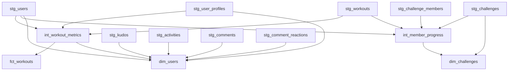

# Penkkikarnevaalit Analytics

End-to-end analytics pipeline for [Penkkikarnevaalit](https://penkkikarnevaalit.fi) — a social bench press tracking app where friend groups compete in collective strength challenges.

An ELT pipeline over two sources: the app's live Supabase database and the Open-Meteo weather API. Transformation runs through a three-layer dbt architecture into a local DuckDB warehouse, orchestrated with Dagster, and published as a static dashboard.

Every number on the dashboard is reconciled against what the application shows its users. That reconciliation is the point — the first version passed all 47 tests while reporting a figure that was 78 percentage points wrong.

## Architecture

```
Supabase (prod) ──┐
                  ├─→  Python extract  →  DuckDB (raw)  →  dbt  →  marts  →  dashboard.html
Open-Meteo API ───┘
                              ↑                            ↑                      ↑
                        Dagster orchestrates every step as an asset
```

The weather extract reads the workout date range from DuckDB and fetches exactly
that window, so it genuinely depends on the Supabase extract having run first.

### Why these tools?

| Tool | Why |
|------|-----|
| **DuckDB** | Local, zero-config warehouse. No cloud account needed. Portable — anyone can clone this repo and query the data. |
| **dbt (dbt-duckdb)** | Industry-standard transformation layer. Schema tests, documentation, and lineage built in. |
| **Dagster** | Asset-based orchestration, scheduling and run history. Runs each step through `PipesSubprocessClient` rather than `dagster-dbt`, whose metadata caps `Requires-Python <3.14` ([#33903](https://github.com/dagster-io/dagster/issues/33903)). Trade-off: the dbt run is one asset instead of fifteen. |
| **Python** | Extraction from the Supabase SDK and the Open-Meteo REST API. Handles pagination, empty tables and loud failure. |

## Data Lineage

### Full Pipeline

```mermaid
graph LR
    subgraph Source
        SB[(Supabase)]
    end

    subgraph Extract
        PY[supabase_to_duckdb.py]
    end

    subgraph DuckDB
        RAW[(raw schema)]
    end

    SB --> PY --> RAW
    RAW --> STG
    STG --> INT
    INT --> MARTS

    subgraph STG[Staging]
        stg_users
        stg_workouts
        stg_challenges
        stg_challenge_members
        stg_user_profiles
        stg_activities
        stg_kudos
        stg_comments
        stg_comment_reactions
    end

    subgraph INT[Intermediate]
        int_workout_metrics
        int_member_progress
    end

    subgraph MARTS[Marts]
        fct_workouts
        dim_users
        dim_challenges
    end
```



### Model Dependencies



## dbt Model Architecture

### Staging (`models/staging/`)
Raw source cleaning: renames, type casts, filters out invalid data. Materialized as **views**.

| Model | Source | Key Logic |
|-------|--------|-----------|
| `stg_users` | `raw.users` | All users (active + inactive) for FK integrity, renames to analytics-friendly columns |
| `stg_workouts` | `raw.workouts` | Validates Brzycki 1RM formula, filters invalid sets (0 reps, >12 reps) |
| `stg_challenges` | `raw.challenges` | Derives `challenge_duration_days`, `kg_to_gain` |
| `stg_challenge_members` | `raw.challenge_members` | Membership junction table with starting/target 1RM |
| `stg_user_profiles` | `raw.user_profiles` | Body weight, height, experience level |
| `stg_activities` | `raw.activities` | Activity feed events |
| `stg_kudos` | `raw.kudos_reactions` | Emoji reactions on activities |
| `stg_comments` | `raw.activity_comments` | Text comments on activities |
| `stg_comment_reactions` | `raw.comment_reactions` | Emoji reactions on comments |
| `stg_weather` | `raw.weather` | Second source. Daily temperature and precipitation, plus analytics-owned temperature bands |

### Intermediate (`models/intermediate/`)
Business logic and joins. Materialized as **views**.

| Model | Purpose |
|-------|---------|
| `int_workout_metrics` | Each workout enriched with user context, PR detection, relative strength, running best 1RM, training consistency |
| `int_member_progress` | Each challenge member's current state: latest 1RM, progress %, engagement status (active/cooling_off/at_risk) |

### Marts (`models/marts/`)
Consumption-ready tables for BI tools. Materialized as **tables**.

| Model | Purpose |
|-------|---------|
| `fct_workouts` | Fact table: every bench press set with PR flags and running metrics |
| `dim_users` | User dimension: lifetime stats, current rank, social engagement |
| `dim_challenges` | Challenge dimension: goal progress, team composition, engagement health, standout members, and an overall health signal |

## Domain Concepts

### Brzycki 1RM Formula
Estimates one-rep max from submaximal sets:

```
1RM = weight × (36 / (37 - reps))
```

Capped at 12 reps for accuracy. This is the core metric of the entire application.

### Challenge Progress

The app measures progress as the team's combined current 1RM against the goal:

```
progress_% = min(current_total_1rm / goal_total_1rm × 100, 100)
```

`goal_total_1rm` is the sum of members' personal targets, falling back to
`challenges.goal_kg` when no member has set one.

`current_total_1rm` sums each member's **most recent** logged 1RM — not their
best. A lighter session lowers it, which is what the app shows.

Members with no logged workouts contribute nothing to the numerator while
still counting toward the goal.

### What the analytics adds

A few columns have no counterpart in the app. They are prefixed or named so
they cannot be mistaken for something on screen, and they are listed in
[RECONCILIATION.md](RECONCILIATION.md):

| Column | Meaning |
|--------|---------|
| `analytics_engagement_status` | Four inactivity states (7/14-day thresholds). The app shows two. |
| `overall_health` | Challenge scorecard: engagement combined with progress vs. elapsed time. |
| `kudos_received_excl_self` | Kudos count excluding self-reactions. The app counts them. |

There is no rank or tier system. An earlier version of this project computed
one; it was removed because the app has no such concept, and because
`user_profiles` is empty in production so the bodyweight it needed is NULL for
every row.

## Setup

### Prerequisites
- Python 3.10+
- Access to the Penkkikarnevaalit Supabase project (service key)

### Install

```bash
# Clone and install
git clone <repo-url>
cd penkkikarnevaalit-analytics
pip install -e .

# Configure credentials
cp .env.example .env
# Edit .env with your Supabase URL and service key
```

### Run the Pipeline

```bash
# Option 0: No Supabase credentials? Seed synthetic data instead.
python extract/seed_dev_data.py        # Fills raw.* with a production-shaped fixture
dbt build                              # Everything below works from here

# Option 1: Run steps manually against real Supabase
python extract/supabase_to_duckdb.py   # Extract
dbt run                                 # Transform
dbt test                                # Validate

# Option 2: The whole pipeline in one command
.
efresh.cmd                          # extract, weather, dbt build, dashboard

# Option 3: Via Dagster, with a UI and run history
.\dagster.cmd                          # then open http://localhost:3000
```

`refresh.cmd` and `dagster.cmd` wrap PowerShell so they run regardless of the
machine's execution policy. Both call the same four scripts; neither calls the other.

### Explore the Data

```bash
# Query the warehouse directly
duckdb warehouse.duckdb

# Example queries (dbt-duckdb prefixes custom schemas with the target schema)
SELECT * FROM main_marts.fct_workouts LIMIT 10;
SELECT * FROM main_marts.dim_users;
SELECT * FROM main_marts.dim_challenges;
```

## Testing

Two kinds of tests:

**Schema tests** (in YAML files alongside each model layer):
- **Unique + not_null** on all primary keys
- **Relationships** tests (e.g., workouts → users FK integrity)
- **Accepted values** for enums (challenge_status, member_role, experience_level, activity_type, analytics_engagement_status, overall_health)

**Singular tests** (in `tests/`):
- **`assert_raw_schema_matches_production`** — compares every column in `raw.*` against the 74 columns verified in production Supabase. Fails in both directions: a column that disappears upstream, and one that appears unexpectedly. This is the guard that catches an extract or fixture drifting away from the real schema.
- **`assert_brzycki_1rm_accuracy`** (`warn`) — recomputes the Brzycki formula independently and flags any workout where the app's stored `estimated_1rm` disagrees by more than 0.5 kg, or is NULL.
- **`assert_challenge_baseline_is_set`** (`warn`) — flags challenges with no recorded baseline. This is an upstream app defect: `create_challenge` never sets `goal_start_kg`.

Both drift checks run at `warn` on purpose. At `error` a single odd row skipped
31 downstream nodes and produced no marts at all — an upstream signal is not a
reason to leave the warehouse unbuilt.

**Reconciliation** — the check that neither kind of test performs: see
[RECONCILIATION.md](RECONCILIATION.md) and `analyses/ui_reconciliation.sql`.
Tests prove the pipeline runs. Reconciliation proves it computes what the app
computes.

```bash
dbt test                    # Run all tests
dbt test --select staging   # Run only staging tests
dbt test --select test_type:singular  # Run only singular tests
```

## Project Structure

```
penkkikarnevaalit-analytics/
├── extract/
│   ├── supabase_to_duckdb.py       # Source 1: Supabase → raw
│   ├── weather_to_duckdb.py        # Source 2: Open-Meteo → raw
│   ├── raw_schema.py               # Column lists for raw, shared by both paths
│   └── seed_dev_data.py            # Synthetic fixture — no credentials needed
├── models/
│   ├── staging/                    # 10 views, one per source table
│   ├── intermediate/               # 2 views, joins and business logic
│   └── marts/                      # 3 tables: fct_workouts, dim_users, dim_challenges
├── tests/
│   ├── assert_brzycki_1rm_accuracy.sql          # App's 1RM vs the formula
│   ├── assert_challenge_baseline_is_set.sql     # Surfaces an upstream app defect
│   └── assert_raw_schema_matches_production.sql # 74 columns, guards schema drift
├── analyses/
│   └── ui_reconciliation.sql       # Pipeline figures in the shape the app shows them
├── reports/
│   ├── _template.html              # Dashboard template, __PK_DATA__ placeholder
│   ├── build_dashboard.py          # Reads marts, fills the template
│   └── haastemittaristo.html       # Generated. Gitignored: contains member names
├── orchestration/
│   └── assets.py                   # Four Dagster assets via PipesSubprocessClient
├── refresh.cmd / refresh.ps1       # Whole pipeline, one command
├── dagster.cmd                     # Dagster UI on :3000
├── RECONCILIATION.md               # Metric-by-metric agreement with the app
├── PLAYBOOK.md                     # The method, reusable on other projects
├── dbt_project.yml
├── profiles.yml
├── pyproject.toml
├── .env.example
├── .gitignore
└── README.md
```

## Author

**Harri Aro** — [harriaro.fi](https://harriaro.fi)
